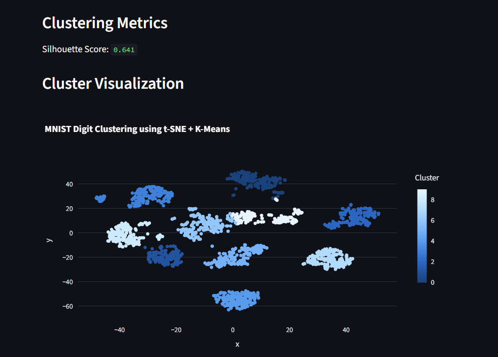
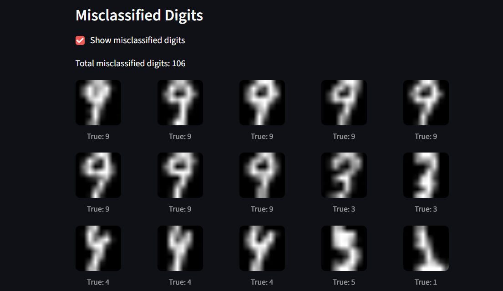

# MNIST Digit Clustering with t-SNE Visualization

## Project Overview
This project implements an interactive system to visualize clustering of handwritten digit images from the MNIST dataset.
It uses t-SNE for dimensionality reduction and K-Means clustering to group visually similar digits.

## Dataset
The project uses the MNIST digits dataset from sklearn.datasets.load_digits().

- Total samples: 1797
- Image size: 8x8 grayscale
- Digit classes: 0–9

## Methodology
1. Loaded digit images and labels
2. Reduced dimensions using t-SNE
3. Applied K-Means clustering
4. Visualized clusters interactively using Streamlit

## Interactive Features
- Adjustable number of clusters (k = 3 to 15)
- Interactive zoom and hover
- Display of silhouette score
- Option to view misclassified digits

## Installation and Running the Application

Step 1: Clone the repository
git clone https://github.com/Nikhilesh-005/mnist-tsne-clustering

Step 2: Install dependencies
python -m pip install -r requirements.txt

Step 3: Run the application
streamlit run app.py

## Key Learnings
- Understanding dimensionality reduction using t-SNE
- Applying unsupervised clustering with K-Means
- Evaluating clustering using silhouette score
- Building interactive ML applications

## Technologies Used
- Python
- NumPy
- scikit-learn
- Plotly
- Streamlit

## 📸 Screenshots
### t-SNE Cluster Visualization

### Misclassified Digits

## Author
Nikhilesh Alladasetti
AI / Backend Internship Assignment – Sparkable Digital Solutions
